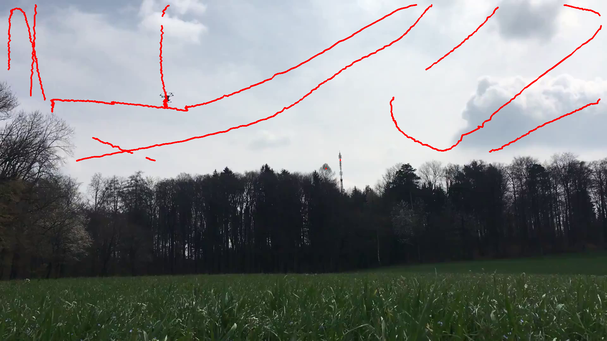
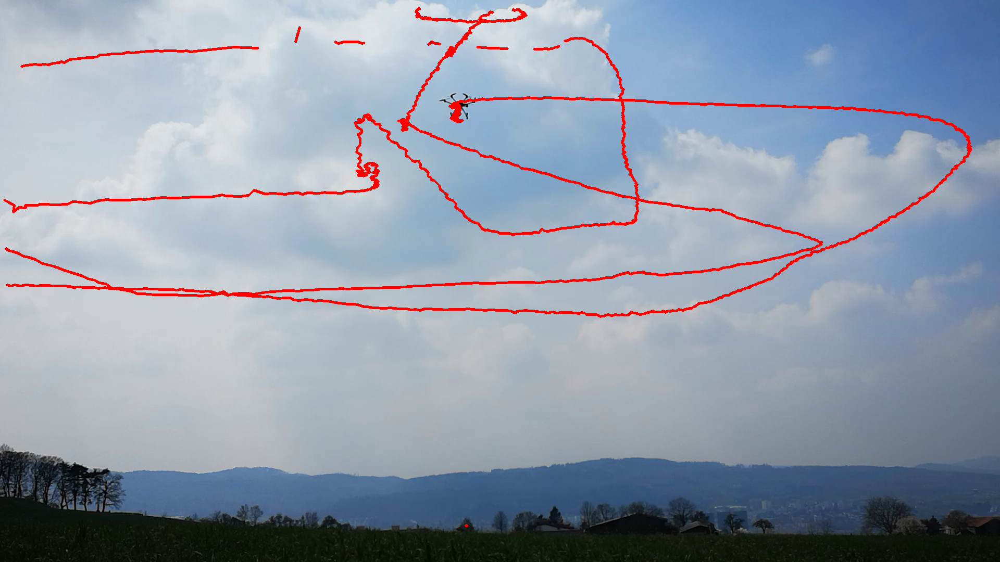
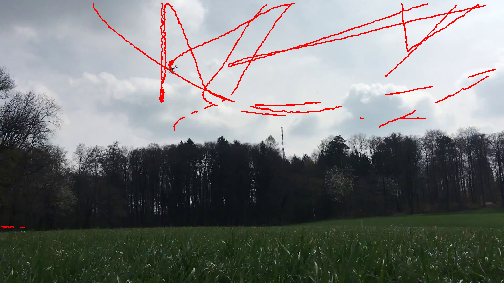
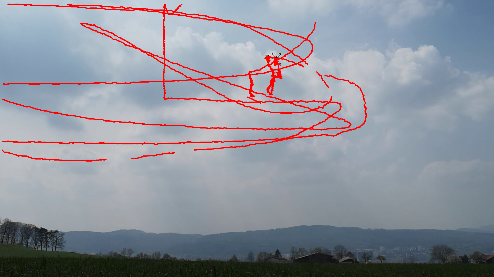

## Requirements

- Python 3.8+
- numpy
- opencv-python
- ultralytics
- filterpy

Install dependencies:

    pip install -r requirements.txt

---

## Dataset and Comparison

The original dataset should be downloaded separately from:

    https://github.com/CenekAlbl/drone-tracking-datasets

and placed under:

    drone_tracking/drone-tracking-datasets/

This repository does not include the dataset due to size and licensing constraints.

## Qualitative Comparison

| Original dataset | Our results |
|------------------|------------|
|  |  |
|  |  |
|  |  |
|  |  |

The discontinuation between the trajectory lines in "Our results" is due to the YOLO model failing to detect the target object under occlusion and pixel visibility constraints.

(The trajectory lines in the original dataset is consistent with the video in most areas, but not completely accurate)

---

## Running the Code

Configure the input video and output settings in the script of run.py:

    CONFIG = {
        "video_path": "drone-tracking-datasets/dataset1/cam0.mp4",
        "output_dir": "outputs",
        "output_name": "dataset1_cam0_trajectory.png",
    }

